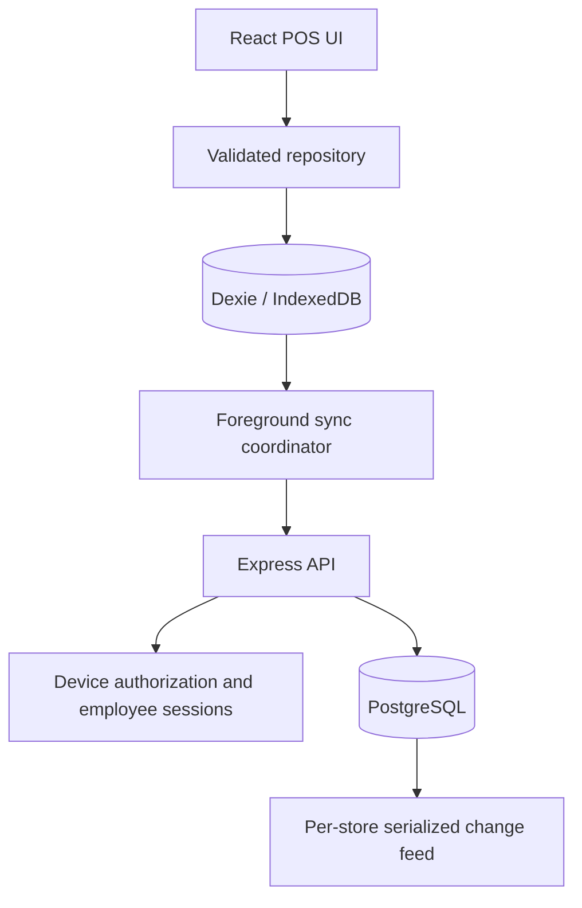

# 02 — System Architecture

**Status:** Revised Phase 1 pilot design; not an implementation verification report.

## 2.1 Components

The initial supported operating mode is one active register session per provisioned browser profile.
Coordinate tabs and workers through an expiring database lease; secondary tabs are read-only until they acquire ownership. Background execution is opportunistic. Resuming or reopening the application restarts synchronization.

## 2.2 Checkout

1. Validate cashier permissions, cart math, current device state, and any required manager approval.
2. In one Dexie transaction write the order, line items, nested payment record, attached audit events, pending stock adjustment, receipt sequence, and one order outbox operation.
3. Show completion only after transaction commit.
4. Offer print/reprint and optional WhatsApp handoff. Print cancellation or failure does not undo the sale.
5. Push and pull asynchronously. A successfully provisioned terminal does not need a network response to complete cash checkout within its offline authorization window.

Receipt identity and order identity are allocated once per checkout attempt. Disable repeated submission and reuse the same checkout ID after an ambiguous UI response. A reload offers the last committed sale before starting another checkout.

## 2.3 Synchronization

The sync coordinator renews a device lease, refreshes device authorization when needed, drains eligible operations, then pulls committed changes. Sales may continue while synchronization runs.

Stock display is derived from a server base plus local sale adjustments not represented in that base. It is not a single mutable count overwritten on pull. Document 03 defines the acknowledgement/checkpoint rule.

Each operation is committed independently at the server. Its business rows, inventory, audit events, durable replay result, and change-feed entries commit together. Partial batch success is expected.

## 2.4 Trust and ownership

- The server derives store identity from authenticated device membership and checks every referenced entity belongs to that store.
- Catalog changes are server-managed only. Direct administrative database writes must use the same serialized change publication path as API writes.
- Employee permissions are server-enforced for online operations. Offline approval evidence records the actor and cached authorization version; it is not proof against a compromised device.
- A device uploads completed historical sales independently of whichever cashier is now logged in. Historical permission changes require reconciliation, not silent deletion of completed sales.
- Raw PIN verifiers are returned only through the authorized device bootstrap/credential-update projection, never ordinary public catalog responses.

## 2.5 Bootstrap, recovery and deployment

Online provisioning allocates a unique installation ID and receipt prefix, establishes device credentials, installs the app shell, and downloads store configuration, employee verifiers and the initial catalog/stock snapshot.

Checkout stays disabled until bootstrap is complete. Snapshot pages share a stable snapshot ID and checkpoint; concurrent changes after that checkpoint are pulled before declaring the terminal ready.

Storage loss requires online reprovisioning with a new installation ID and receipt prefix. Synced records can be restored through a device-history recovery endpoint. Unsynced records lost with local storage cannot be reconstructed from the server; document 06 requires explicit pilot recovery acceptance.

Service-worker and Dexie upgrades must wait for active checkout transactions, preserve pending operations, and reject unsupported payload versions visibly. Do not clear storage to resolve upgrade errors.

Production deployment uses HTTPS, restricted database credentials, tested cookie/CSRF/CORS configuration, database backups and restore drills, and monitoring for rejected operations and stale devices.

## 2.6 Future architecture

Local LAN relay is Phase 5 only. Native storage, direct printing, reporting replicas and integrated payment services require separate designs and do not participate in the Phase 1 critical path.
