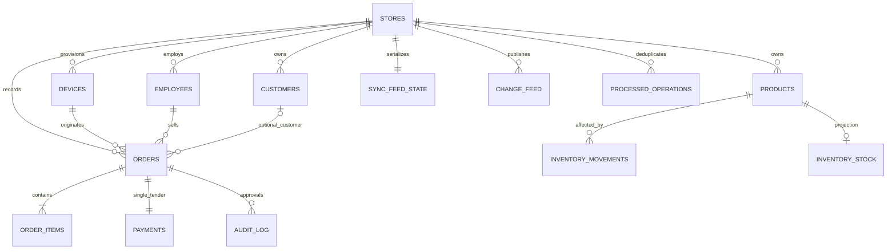

# 04 — Data Model and Storage Contract

**Status:** Revision 3 — proposed schemas, not generated or verified against live databases.
Document 03 owns sync behavior; document 05 owns business rules.

## 4.1 Central logical relationships

Cardinalities express intended invariants; constraints and transaction logic must enforce them. A foreign key alone does not guarantee that a parent has a child.

## 4.2 Central entity definitions

All store-owned entities include store_id. Composite references enforce that related rows belong to the same store, including product/category/tax, order/customer/employee/device and movement/product/device. Server handlers also enforce authorization.

| Entity | Required fields and constraints |
|---|---|
| stores | id UUID PK, code unique, name, timezone, currency, currency_exponent=2, catalog_version |
| devices | id UUID PK (installation), store_id, device_code, receipt_prefix globally unique, active, provisioned_at, last_seen_at |
| device_sessions | id, store_id, device_id, refresh_token_hash, expires_at, revoked_at, rotated_from; server-only |
| employees | id UUID PK, store_id, name, role cashier/manager/admin, permissions JSONB, permission_version, pin_verifier, pin_salt, pin_algorithm, pin_iterations, is_active |
| categories | id UUID PK, store_id, name, parent_id nullable, active |
| tax_rates | id UUID PK, store_id, name, rate_bps integer 0..10000, active |
| discounts | id UUID PK, store_id, name, type percent/fixed_amount, value, active, starts_at, ends_at; percentage basis points bounded 0..10000 |
| products | id UUID PK, store_id, sku unique per store, barcode indexed, name, category_id, tax_rate_id, unit_price_cents BIGINT, active, revision |
| customers | id UUID PK client-supplied, store_id, name, phone_normalized nullable and nonunique, created_at; no Phase 1 merge/edit/loyalty contract |
| orders | id UUID PK=operation_id, store_id, device_id, employee_id, customer_id nullable, receipt_number unique, status completed, currency, store_name_snapshot, timezone_snapshot, customer_phone nullable, subtotal_cents, discount_cents, tax_cents, total_cents BIGINT, catalog_version, employee_permission_version, client_generated_at, server_received_at, schema_version |
| order_items | id UUID PK, store_id, order_id, product_id, product_name_snapshot, sku_snapshot, quantity integer, unit_price_cents BIGINT, tax_rate_bps, discount_applied_cents BIGINT, tax_cents BIGINT, line_total_cents BIGINT, catalog_version |
| payments | id UUID PK independent of operation_id, store_id, order_id unique, device_id, method cash/card, amount_cents, tendered_cents, change_cents BIGINT, external_reference nullable, status completed, client_generated_at, server_received_at |
| audit_log | id UUID PK client-generated, store_id, order_id, actor_id, cashier_id, action, permission_version, details JSONB, client_generated_at, server_received_at; immutable |
| inventory_movements | movement_id UUID PK, store_id, product_id, device_id, order_id nullable, operation_id, delta nonzero integer, reason sale/opening_stock, server_received_at; unique(store_id, operation_id, product_id) |
| inventory_stock | store_id + product_id PK, current_stock integer (negative permitted), updated_at; derived exclusively from movements |
| oversell_alerts | id UUID PK, store_id, product_id, order_id, resulting_stock, created_at, resolved, resolution_note; unique triggering movement identity |
| processed_operations | store_id + operation_id PK, device_id, entity_type, payload_hash, result_json, accepted_checkpoint, processed_at; no scheduled accepted-receipt pruning |
| sync_feed_state | store_id PK, last_position BIGINT; transactional counter locked before publishing writes |
| change_feed | store_id + position PK, entity_type, entity_id, action upsert/delete, version, device-safe payload JSONB; indexed for ordered store pull |
| sync_snapshots | snapshot_id UUID PK, store_id, checkpoint, created_at, expires_at, immutable paginated snapshot payload/reference |

Opening stock must enter through a controlled seed/import operation that uses the same store lock and movement projection path. Do not seed inventory_stock independently.

## 4.3 Local Dexie entities

These are IndexedDB object stores, not executable SQLite DDL. UUIDs are strings, timestamps are ISO strings, amounts are validated safe integers. Central BIGINT checkpoints travel as decimal strings and are compared using BigInt; Dexie ordering uses separate numeric local keys where required.

| Object store | Primary key / important indexes | Local fields or behavior |
|---|---|---|
| device_identity | device_id | store_id, device_code, receipt_prefix, protocol_version, provisioned_at; one active installation |
| store_config | store_id | name, timezone, currency, exponent, catalog_version |
| employees | id | Safe device-scoped verifier projection, permissions, permission_version, active, last_synced_at |
| session | singleton key | employee_id, logged_in_at, last_server_validated_at, failed_attempts, locked_until, last_observed_time |
| categories, tax_rates, discounts | id; active | Server-owned cache |
| products | id; sku, barcode, category_id, active | Server-owned cache plus delivered catalog_version |
| customers | id; phone_normalized | Create-only local records with creating_operation_id and sync_status |
| orders | id; &receipt_number, client_generated_at, sync_status | Central snapshot fields plus sync_status pending_sync/synced/failed |
| order_items | id; order_id, product_id | Immutable central snapshot fields |
| payments | id; &order_id | Business status completed, separate sync_status; independent UUID |
| audit_log | id; order_id, actor_id | Approval evidence attached to order operation; no independent audit operation |
| server_stock | product_id | Last pulled authoritative current_stock |
| stock_adjustments | [operation_id+product_id]; operation_id, product_id | delta, accepted_checkpoint nullable, reconciliation_state |
| outbox | ++id; &operation_id, status, next_attempt_at | entity_type order/customer, immutable payload, depends_on, failure_kind nullable, reason_code, reason, attempt_count, lease_owner, lease_expires_at, accepted_checkpoint, synced_at |
| sync_metadata | key | last_pull_checkpoint, last_receipt_seq, bootstrap state and application schema version |
| sync_lease | singleton key | owner_id, expires_at, last_renewed_at |

outbox.status is pending/in_flight/synced/failed. failure_kind is nullable or connectivity/authentication/dependency/validation. UI categories are derived as specified in document 03.

## 4.4 Validation and transactions

Dexie does not inherit SQL CHECK or foreign-key enforcement. Repository validation checks required fields, money bounds, quantities, references, unique receipt identity and permissions before writes. Include every touched object store in its transaction scope.

- Checkout: orders, order_items, payments, audit_log, stock_adjustments, outbox, sync_metadata.
- Customer create: customers and outbox atomically.
- Push result: outbox, orders/customers/payments and stock_adjustments atomically.
- Pull: all affected cache stores, stock_adjustments and sync_metadata atomically.
- Manager approval for checkout is persisted with the sale; approval for discarding an uncommitted cart is local diagnostic history and does not claim a synced order exists.

Server constraints enforce row-level ranges and references. Transaction handlers validate cross-row order totals, payment equality and required approval evidence. Tests must demonstrate these rules; diagrams are not evidence of enforcement.

## 4.5 Deferred entities

Refunds/refund_items, customer merge logs, loyalty, local catalog edits, standalone adjustments, fraud analytics and formal shifts are Phase 2+ design work. A future return movement must reference the original order through order_id and the return through a separate refund_id; never store a refund UUID in an orders foreign key.

## 4.6 Required artifacts

Create db/postgres migrations, client Dexie schema/migrations, domain validators and api/openapi.yaml from this contract. Check them together in review and retain reproducible test commands/results. No such artifacts are present in the current package.
